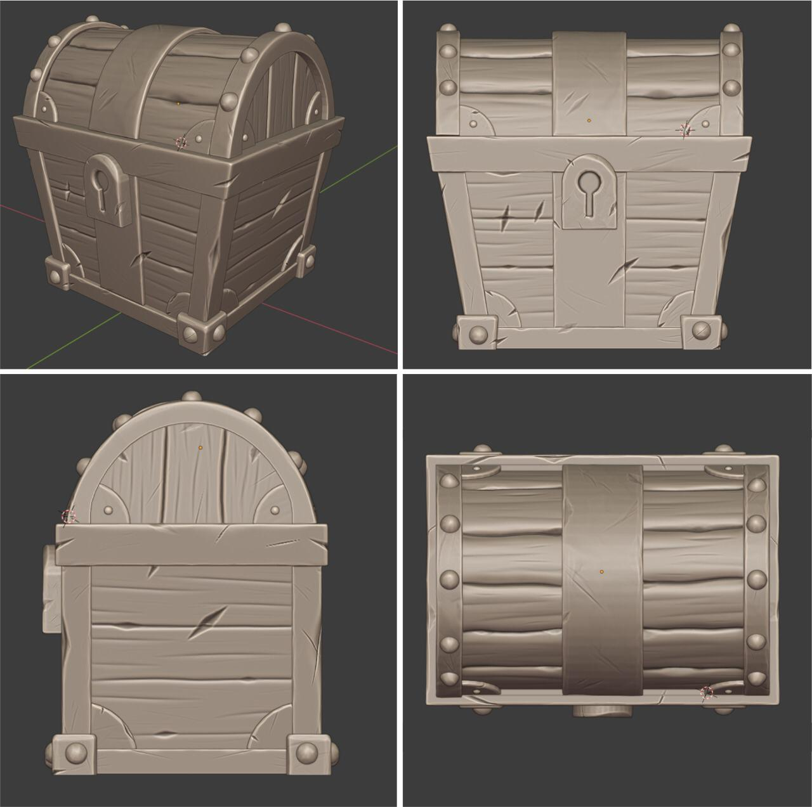

# Blender | 3D modeling studies

#### Este portfolio foi criado para registrar o progresso dos meus estudos de modelagem 3D realizados no software Blender

-----------------------------------------------------------------------------------------------------------------------------------------------------------------------------------

## BMO | HORA DE AVENTURA 
[Modelagem realizada através dos tutoriais da InsightZ](https://www.youtube.com/channel/UCYXoautmTvZFuU1Lj6XLJ8Q)

## BAÚ
[Modelagem realizada através dos tutoriais da InsightZ](https://www.youtube.com/channel/UCYXoautmTvZFuU1Lj6XLJ8Q)

